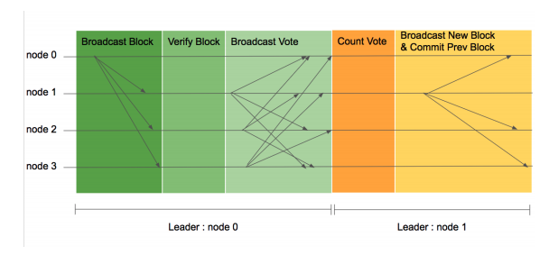

## LFT Normal Case

**이미지 기본 설명**
* 각 수평선은 블록체인 네트워크에 참여하는 노드를 나타내며 화살표는 한 노드가 다른 노드에 보내는 메시지를 의미합니다.
* 네트워크 이벤트의 순서는 왼쪽에서 오른쪽으로 일어난다. 따라서, 왼쪽에서 일어난 이벤트가 오른쪽에서 일어난 이벤트보다 먼저 일어난 이벤트입니다.
* 가장 밑의 평행선은 기간에 따른 리더를 표시하고 있습니다.

**LFT 합의 순서**
1. 합의가 시작되면 검증 노드들은 리더 노드에 처리하기 원하는 트랜잭션을 전송합니다.
2. 리더 노드는 수집한 트랜잭션을 이용하여 블록을 생성하고 자신의 서명과 함께 다른 모든 검증 노드에 전송합니다.(Broadcast Block)
3. 각 검증 노드들은 블록을 받으면 다음의 순서로 검증합니다
  1. 현재 리더가 블록을 생성했는지 확인합니다.
  2. 블록의 높이와 이전 블록 해시가 올바른지 확인합니다.
  3. 블록의 메시지가 올바른지 확인합니다.(Verify block).
  4. 검증 노드는 검증 결과에 따라 투표 메시지를 모든 노드들 에게 보냅니다.(Broadcast Vote)
  5. 각 노드가 정족수 이상의 투표를 받게 되면 해당 높이의 블록을 자신의 블록체인에 추가합니다.(Count Vote). 리더 노드는 정족수 이상의 투표를 받으면 해당 높이의 블록 생성을 성공으로 처리합니다.
  6. 다른 노드에서 받은 트랜잭션을 모아 새로운 높이의 블록을 생성하고 다른 모든 피어에 새로운 높이의 블록 메시지를 보냅니다.
