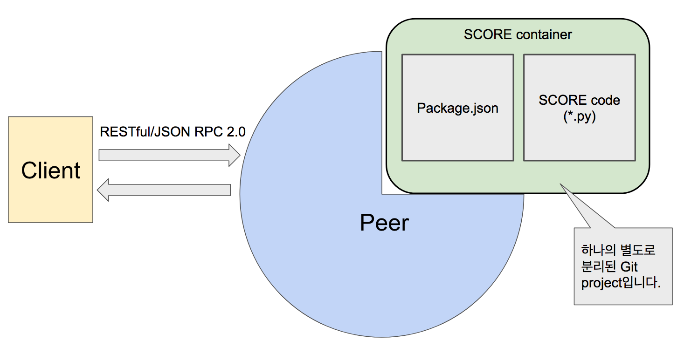
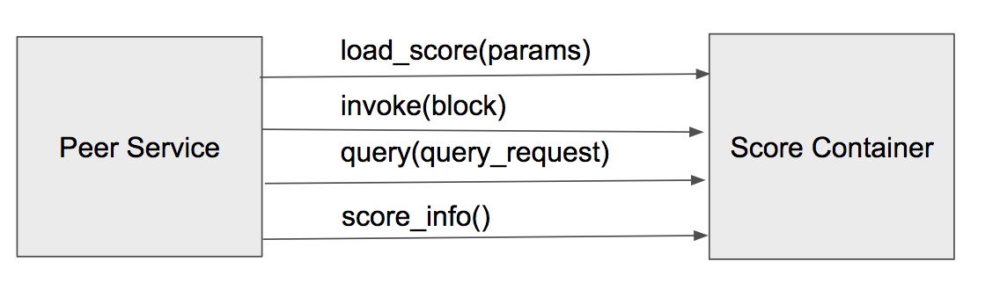

# SCORE(Smart Contract On Reliable Environment)

## SCORE란?
* loopchain의 Smart Contract입니다.
* 별도의 VM(Virtual Machine)이 없이 Peer가 돌아가는 Machine위에서 직접 실행됩니다.
  - Python Code로 직접 작성할 수 있어 높은 생산성을 가지고 있습니다.
* Blockchain 프로세스와 별도의 프로세스로 동작하면서 다양한 업무의 지원이 가능합니다.
* 각 Peer에서 독립적으로 실행되며, Block이 확정되는 시점에서 실행됩니다.
* Block 별로 실행하며, Blockchain으로 구성하는 비지니스 로직을 구현합니다.
* Python 언어로 개발되며, loopchain의 dependency 를 따릅니다.

## SCORE 구조




* Github가 현재 SCORE STORE를 대신하고 있습니다.
* SCORE container
  * `Package.json`: Function의 정의가 작성되어 있다. 그리고, 실제 SCORE code가 어떤 파일인지 정의되어 있음. Package.json파일에 정의되어 있는 형식으로 Client가 peer와 통신을 합니다.
  * `SCORE code(*.py)`: Python으로 구현된 SCORE용 코드
  * 해당 Project는 Git을 통해서 배포해야 합니다. 아니면 파일로 해당 프로젝트를 압축해서 따로 올려야 합니다.


## SCORE 동작 과정

1. Tx가 만들어지고 합의가 이뤄집니다.
2. 합의에 의해 Block이 검증됩니다.
3. 검증된 Block내 Tx 데이터를 가지고 invoke()를 수행합니다.
5. invoke()한 결과를 내부 DB(SCORE DB)에 저장합니다.
6. invoke() 과정에서 저장한 결과는 query()로 찾습니다.




내부에 여러 실제 작업들에 대한 함수들이 있고 이것을 JSON-RPC 방식으로 호출합니다.(Python으로 작성되어 있음)
작업된 결과는 SCORE DB에 저장합니다.(NoSQL 방식으로 Key-value로 저장)
* invoke() : 검증되고 합의된 transaction 을 가지고 실제 계약 업무를 실행하는 작업
* query() : SCORE DB에 저장된 결과를 읽어오는 작업
* 내부에 여러 실제 작업들에 대한 함수들이 있고 이것을 JSON-RPC 방식으로 호출합니다.
* 실제 구현은 Python으로 작성되어 있습니다.
* 작업된 결과는 SCORE DB에 저장한다.
  - NoSQL 방식으로 Key-value로 저장
* 외부에 노출된 함수
  * invoke() : 검증되고 합의된 transaction 을 가지고 실제 계약 업무를 실행하는 작업
  * query() : SCORE DB에 저장된 결과를 읽어오는 작업


## SCORE 실행 순서 설명

1. RadioStation이 실행할 때에 이용하는 ```channel_manage_data.json```의 ```score_package``` 옵션에서 특정 채널에서 불러올 SCORE를 지정합니다.
  ```
  {
    "channel1":
      {
        "score_package": "{your_github_id}/contract_sample"
      }
  }
  ```
2. docker로 Peer를 실행할 때의 `DEFAULT_SCORE_HOST`옵션으로 SCORE를 가져올 Git service URL을 지정합니다.
```
$ docker run -d --name peer0 \
   .....
   -e "DEFAULT_SCORE_HOST=github.com" \
   .....
```

3. Peer가 시작하면서 Git servie에서 SCORE가 있는 Repository[Package.json, SCORE code(*.py)]를 pull합니다.
4. Pull받은 코드 중에 Package.json에서 모듈들을 읽어서 다른 Process로 실행합니다.
