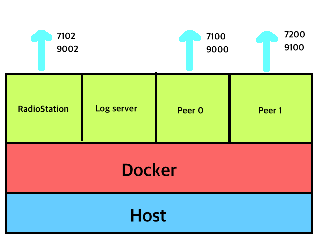

# Local computer에서 RadioStation과 2개의 Peer로 Blockchain network 구성하기


## 목적
자신의 컴퓨터상에서 Docker를 이용하여 RadioStation과 Peer 2개로 구성된 네트워크 환경을 구성하고 정상적으로 동작하는지 테스트를 합니다. 다음의 그림과 같은 구조로 네트워크가 구성이 됩니다.



## 디렉토리 구성
이 문서의 내용을 따라하게 되면 다음과 같은 디렉토리 구성이 만들어지게 됩니다.


```
├── conf
│   ├── channel_manage_data.json
│   ├── peer_conf0.json
│   ├── peer_conf1.json
│   └── rs_conf.json
├── fluentd
│   └── etc
│       └── fluent.conf
├── logs
├── storageRS
├── storage0
├── storage1
├── start.sh
├── stop.sh
└── delete.sh

```


## 설정 파일 생성
###  디렉토리 생성
먼저 로그서버의 설정 파일 폴더를 생성하고 로그를 따로 저장할 폴더를 생성합니다. 그리고 RadioStation과  Peer의 설정파일을 따로 보관할 폴더를 만듭니다.
```
$ mkdir -p fluentd/etc.   	# 로그서버의 설정 파일 폴더를 생성.
$ mkdir logs.			# 로그를 따로 저장할 폴더를 생성.
$ mkdir conf			# RadioStation과  Peer의 설정파일을 따로 보관할 폴더를 생성.
```

### 설정 파일 생성 및 이동

#### log 서버의 설정
log 서버의 설정 파일을 작성하고 설정 파일 위치로 이동합니다. 이것은 모든 log 들을 파일로 남기는 설정입니다.

 1. `fluent.conf`을 아래와 같이 만듭니다.

 ```
 <source>
 	@type forward
 	@id input1
 	port 24224
 	bind 0.0.0.0
 </source>

 <match **> # Add your log tag to show in <>.
 	@type copy
 	<store> # Add your log tag to show in <>.
 		@type file # Leave log file in path.
 		path /logs/data.*.log
 		symlink_path /logs/data.log time_slice_format %Y%m%d
 		time_slice_wait 10m
 		time_format %Y%m%dT%H%M%S%z
 		compress gzip
 		utc
 	</store>
 </match>
 ```

 2. 작성된 `fluent.conf`를 `fluentd/etc` 디렉토리로 이동합니다.
```
$ mv fluent.conf ./fluentd/etc
```

#### `channel_manage_data.json` 작성
이 설정 파일은 multichannel을 사용할 때에 설정하는 파일입니다. 해당 파일은 RadioStation에서 사용됩니다.

 1. `channel_manage_data.json` 파일을 아래와 같이 작성합니다.
 ```
 {
 	"channel1": {
 		"score_package": "loopchain/default"
 	}
 }
 ```
   - ‘channel1’이라는 channel에서 loopchain/default라는 SCORE를 이용합니다.
   - loopchain/default는 기본적으로 각 peer들이 가지고 있는 SCORE 파일입니다.

 2. 작성된 `channel_manage_data.json`를 `/conf` 디렉토리로 이동합니다.
```
mv channel_manage_data.json ./conf
```

#### `rs_conf.json` 작성
이 설정 파일은 RadioStation의 설정들을 담고 있는 파일입니다.

 1. `rs_conf.json`파일을 아래와 같이 작성합니다.
 ```
 {
	"CHANNEL_MANAGE_DATA_PATH": "/conf/channel_manage_data.json",
	"LOOPCHAIN_DEFAULT_CHANNEL": "channel1",
	"ENABLE_CHANNEL_AUTH": false
}
 ```
   - CHANNEL_MANAGE_DATA_PATH: channel_manage_data.json이 어디에 있는지 지정해줍니다.
   - LOOPCHAIN_DEFAULT_CHANNEL: RadioStation에서  `channel_manage_data.json`에서 설정한 channel 중에 별도로 지정하지 않고 request가 들어오면 기본적으로 사용할 channel을 정합니다.
   - ENABLE_CHANNEL_AUTH: 정해진 Server들만 각 channel별로 들어올 수 있는 제한을 하는 Option입니다.

 2. 작성된 `rs_conf.json`를 `/conf` 디렉토리로 이동합니다.
```
$ mv rs_conf.json ./conf
```


#### `peer_conf0.json` 작성
이 설정 파일은 Peer0의 설정을 담고 있는 파일입니다.

 1. `peer_conf0.json` 파일을 아래와 같이 작성합니다.
 ```
 {
 	"LOOPCHAIN_DEFAULT_CHANNEL": "channel1",
 	"DEFAULT_SCORE_BRANCH": "master"
 }
 ```
   - LOOPCHAIN_DEFAULT_CHANNEL: 해당 peer가 channel_manage_data.json에서 설정한 channel중에 별도로 지정하지 않고 request가 들어오면 기본적으로 사용할 channel을 정합니다.
   - DEFAULT_SCORE_BRANCH: SCORE를 사용할 때, 어떤 branch의 것을 이용 할지를 정합니다. 기본값은 master입니다. 참고로 SCORE는 git repository로 원격 git repository의 것을 clone해서 쓰거나 따로 파일로 읽어오게 해야 합니다.

 2. 작성된 `peer_conf0.json`를 `/conf` 디렉토리로 이동합니다.
```
$ mv peer_conf0.json ./conf
```

#### `peer_conf1.json` 작성
이 설정 파일은 Peer1의 설정을 담고 있는 파일입니다.

 1. `peer_conf1.json` 파일을 아래와 같이 작성합니다.
 ```
 {
 	"LOOPCHAIN_DEFAULT_CHANNEL": "channel1",
 	"DEFAULT_SCORE_BRANCH": "master"
 }
 ```
   - LOOPCHAIN_DEFAULT_CHANNEL: 해당 peer가 channel_manage_data.json에서 설정한 channel중에 별도로 지정하지 않고 request가 들어오면 기본적으로 사용할 channel을 정합니다.
   - DEFAULT_SCORE_BRANCH: SCORE를 사용할 때, 어떤 branch의 것을 이용 할지를 정합니다. 기본값은 master입니다. 참고로 SCORE는 git repository로 원격 git repository의 것을 clone해서 쓰거나 따로 파일로 읽어오게 해야 합니다.

 2. 작성된 `peer_conf1.json`를 `/conf` 디렉토리로 이동합니다.
```
$ mv peer_conf1.json ./conf
```


## Docker Container 실행
Docker Container를 실행하는 순서는 다음과 같습니다.
  1. Log 서버를 실행합니다.
  2. RadioStation을 실행합니다.
  3. Peer를 순차적으로 실행합니다.(Peer0, Peer1)

### Log server 실행
```
$ export TAG=latest     # 환경 변수를 설정합니다.

# Log server 컨테이너를 실행합니다.
$ docker run -d \
--name loop-logger \
--publish 24224:24224/tcp \
--volume $(pwd)/fluentd:/fluentd \
--volume $(pwd)/logs:/logs \
loopchain/loopchain-fluentd:${TAG}

# Log server 컨테이너를 정상적으로 실행되었는지 확인합니다.
$ docker ps --filter name=loop-logger
CONTAINER ID        IMAGE                                COMMAND                  CREATED             STATUS              PORTS                                           NAMES
06d616be61e0        loopchain/loopchain-fluentd:latest   "/bin/entrypoint.sh …"   9 seconds ago       Up 8 seconds        5140/tcp, 24284/tcp, 0.0.0.0:24224->24224/tcp   loop-logger
$
```

### RadioStation 실행
```
# RadioStation에서 이용할 데이타 저장 공간을 만듭니다.
$ mkdir -p storageRS

# RadioStation 컨테이너를 실행합니다.
$ docker run -d --name radio_station \
-v $(pwd)/conf:/conf \
-v $(pwd)/storageRS:/.storage \
-p 7102:7102 \
-p 9002:9002 \
--log-driver fluentd --log-opt fluentd-address=localhost:24224 \
loopchain/looprs:${TAG} \
python3 radiostation.py -o /conf/rs_conf.json

# RadioStation 컨테이너가 정상적으로 실행되었는지 확인합니다.
$ docker ps --filter name=radio_station
CONTAINER ID        IMAGE                     COMMAND                  CREATED             STATUS              PORTS                                                           NAMES
c67e3cfa668a        loopchain/looprs:latest   "python3 radiostatio…"   8 seconds ago       Up 8 seconds        0.0.0.0:7102->7102/tcp, 7100-7101/tcp, 0.0.0.0:9002->9002/tcp   radio_station
$
```


### Peer0실행
```
# Peer 0번에서 이용할 데이타 저장 공간을 만듭니다.
$ mkdir -p storage0

# Peer0 컨테이너를 실행합니다.
$ docker run -d --name peer0 \
-v $(pwd)/conf:/conf \
-v $(pwd)/storage0:/.storage \
--link radio_station:radio_station \
--log-driver fluentd --log-opt fluentd-address=localhost:24224 \
-p 7100:7100 -p 9000:9000 \
loopchain/looppeer:${TAG} \
python3 peer.py -o /conf/peer_conf0.json -p 7100 -r radio_station:7102


# Peer0 컨테이너가 정상적으로 실행되었는지 확인합니다.
$ docker ps --filter name=peer0
CONTAINER ID        IMAGE                       COMMAND                  CREATED             STATUS              PORTS                                                           NAMES
f18c4e082a30        loopchain/looppeer:latest   "python3 peer.py -o …"   7 minutes ago       Up 7 minutes        0.0.0.0:7100->7100/tcp, 0.0.0.0:9000->9000/tcp, 7101-7102/tcp   peer0
$

```

### Peer1실행
```
# Peer 1번에서 이용할 데이타 저장 공간을 만듭니다.
$ mkdir -p storage1

# Peer1 컨테이너를 실행합니다.
$ docker run -d --name peer1 \
-v $(pwd)/conf:/conf \
-v $(pwd)/storage1:/.storage \
--link radio_station:radio_station \
--log-driver fluentd --log-opt fluentd-address=localhost:24224 \
-p 7200:7200 -p 9100:9100 \
loopchain/looppeer:${TAG} \
python3 peer.py -o /conf/peer_conf1.json -p 7200 -r radio_station:7102

# Peer1 컨테이너가 정상적으로 실행되었는지 확인합니다.
$ $ docker ps --filter name=peer1
CONTAINER ID        IMAGE                       COMMAND                  CREATED             STATUS              PORTS                                                                     NAMES
c10d2938efee        loopchain/looppeer:latest   "python3 peer.py -o …"   7 minutes ago       Up 7 minutes        7100-7102/tcp, 0.0.0.0:7200->7200/tcp, 9000/tcp, 0.0.0.0:9100->9100/tcp   peer1
$
```


## 확인하기
제대로 설치되고 실행이 되고 있는지 확인하는 방법은 다음과 같습니다.

### RadioStation의 Channel1에 접속된 Peer들의 정보 출력
`curl http://localhost:9002/api/v1/peer/list?channel=channel1 | python -m json.tool` 명령어를 입력합니다. 정상적으로 동작하고 있다면 다음과 비슷한 메세지가 출력이 될 것입니다.
```
$ curl http://localhost:9002/api/v1/peer/list?channel=channel1 | python -m json.tool
  % Total    % Received % Xferd  Average Speed   Time    Time     Time  Current
                                 Dload  Upload   Total   Spent    Left  Speed
100  1573  100  1573    0     0  64583      0 --:--:-- --:--:-- --:--:-- 65541
{
    "data": {
        "connected_peer_count": 2,
        "connected_peer_list": [
            {
                "cert": "MFYwEAYHKoZIzj0CAQYFK4EEAAoDQgAE+HQPBowjyJnyinsYjiztl5i6hQ1JiWdpRmyFR1T283M4liQia7weerQQ4Qw6jDVwd+RkwHeenvR0xxovUFCTQg==",
                "group_id": "9f109b10-1b8b-11e8-9ab2-0242ac110004",
                "order": 1,
                "peer_id": "9f109b10-1b8b-11e8-9ab2-0242ac110004",
                "peer_type": 1,
                "status": 1,
                "status_update_time": "2018-03-05 07:21:21.848287",
                "target": "172.17.0.4:7100"
            },
            {
                "cert": "MFYwEAYHKoZIzj0CAQYFK4EEAAoDQgAE+HQPBowjyJnyinsYjiztl5i6hQ1JiWdpRmyFR1T283M4liQia7weerQQ4Qw6jDVwd+RkwHeenvR0xxovUFCTQg==",
                "group_id": "c41c2488-2045-11e8-bae4-0242ac110005",
                "order": 2,
                "peer_id": "c41c2488-2045-11e8-bae4-0242ac110005",
                "peer_type": 0,
                "status": 1,
                "status_update_time": "2018-03-05 07:21:27.220094",
                "target": "172.17.0.5:7200"
            }
        ],
        "registered_peer_count": 2,
        "registered_peer_list": [
            {
                "cert": "MFYwEAYHKoZIzj0CAQYFK4EEAAoDQgAE+HQPBowjyJnyinsYjiztl5i6hQ1JiWdpRmyFR1T283M4liQia7weerQQ4Qw6jDVwd+RkwHeenvR0xxovUFCTQg==",
                "group_id": "9f109b10-1b8b-11e8-9ab2-0242ac110004",
                "order": 1,
                "peer_id": "9f109b10-1b8b-11e8-9ab2-0242ac110004",
                "peer_type": 1,
                "status": 1,
                "status_update_time": "2018-03-05 07:21:21.848287",
                "target": "172.17.0.4:7100"
            },
            {
                "cert": "MFYwEAYHKoZIzj0CAQYFK4EEAAoDQgAE+HQPBowjyJnyinsYjiztl5i6hQ1JiWdpRmyFR1T283M4liQia7weerQQ4Qw6jDVwd+RkwHeenvR0xxovUFCTQg==",
                "group_id": "c41c2488-2045-11e8-bae4-0242ac110005",
                "order": 2,
                "peer_id": "c41c2488-2045-11e8-bae4-0242ac110005",
                "peer_type": 0,
                "status": 1,
                "status_update_time": "2018-03-05 07:21:27.220094",
                "target": "172.17.0.5:7200"
            }
        ]
    },
    "response_code": 0
}
$
```

### Peer0의 상태정보를 출력
`curl http://localhost:9000/api/v1/status/peer?channel=channel1 | python -m json.tool` 명령어를 입력합니다. 정상적으로 동작하고 있다면 다음과 비슷한 메세지가 출력이 될 것입니다.

```
$ curl http://localhost:9000/api/v1/status/peer?channel=channel1 | python -m json.tool
  % Total    % Received % Xferd  Average Speed   Time    Time     Time  Current
                                 Dload  Upload   Total   Spent    Left  Speed
100   264  100   264    0     0  19717      0 --:--:-- --:--:-- --:--:-- 20307
{
    "audience_count": "0",
    "block_height": 0,
    "consensus": "siever",
    "leader_complaint": 1,
    "made_block_count": 0,
    "peer_id": "9f109b10-1b8b-11e8-9ab2-0242ac110004",
    "peer_target": "172.17.0.4:7100",
    "peer_type": "1",
    "status": "Service is online: 1",
    "total_tx": 0
}
$
```

### Peer1의 상태정보를 출력
`curl http://localhost:9100/api/v1/status/peer?channel=channel1 | python -m json.tool` 명령어를 입력합니다. 정상적으로 동작하고 있다면 다음과 비슷한 메세지가 출력이 될 것입니다.

```
$ curl http://localhost:9100/api/v1/status/peer?channel=channel1 | python -m json.tool
  % Total    % Received % Xferd  Average Speed   Time    Time     Time  Current
                                 Dload  Upload   Total   Spent    Left  Speed
100   264  100   264    0     0  17546      0 --:--:-- --:--:-- --:--:-- 18857
{
    "audience_count": "0",
    "block_height": 0,
    "consensus": "siever",
    "leader_complaint": 1,
    "made_block_count": 0,
    "peer_id": "c41c2488-2045-11e8-bae4-0242ac110005",
    "peer_target": "172.17.0.5:7200",
    "peer_type": "0",
    "status": "Service is online: 0",
    "total_tx": 0
}
$
```


### log가 저장되고 있는지 확인.
현재 튜토리얼에서는 /logs폴더에 RadioStation, Peer0, Peer1의 로그가 저장되고 있습니다. 이를 확인하기 위해서 /logs 폴더안에 파일들이 생성되고 있는지 확인합니다.
```
$ ls $(pwd)/logs/
data.b5669f50a57554db1a74bc2c19ddb6c16.log	data.log time_slice_format %Y%m%d
data.20180228_0.log.gz				data.20180302_0.log.gz				data.b5669f50a57554db1a74bc2c19ddb6c16.log.meta
$

```

## 실행 스크립트 작성
실제 loopchain 운영의 편의를 위해서 위와 같이 매번 명령어를 직접 입력하기 보다는 실행스크립트 작성이 필요합니다. 다음과 같이 실행스크립트를 작성하고 실행해보자.

### 시작 - start.sh (새로운 컨테이너 실행)
```
#!/usr/bin/env bash

##############################################
#           환경변수등록
##############################################
export TAG=latest
export CONF=$(pwd)/conf
export LOGS=$(pwd)/logs
export FLUENTD=$(pwd)/fluentd
export STORAGE_RS=$(pwd)/storageRS
export STORAGE_PEER_0=$(pwd)/storage0
export STORAGE_PEER_1=$(pwd)/storage1

##############################################
#       로그 및 데이터 디렉토리 생성
##############################################
if [ ! -d ${LOGS} ]
    then    mkdir -p ${LOGS}
fi

if [ ! -d ${STORAGE_RS} ]
    then    mkdir -p ${STORAGE_RS}
fi

if [ ! -d ${STORAGE_PEER_0} ]
    then    mkdir -p ${STORAGE_PEER_0}
fi

if [ ! -d ${STORAGE_PEER_1} ]
    then    mkdir -p ${STORAGE_PEER_1}
fi


##############################################
#           로그서버실행
##############################################
docker run -d \
--name loop-logger \
--publish 24224:24224/tcp \
--volume ${FLUENTD}:/fluentd \
--volume ${LOGS}:/logs \
loopchain/loopchain-fluentd:${TAG}

##############################################
# Radio Station 실행
##############################################
docker run -d --name radio_station \
-v ${CONF}:/conf \
-v ${STORAGE_RS}/storageRS:/.storage \
-p 7102:7102 \
-p 9002:9002 \
--log-driver fluentd --log-opt fluentd-address=localhost:24224 \
loopchain/looprs:${TAG} \
python3 radiostation.py -o /conf/rs_conf.json

##############################################
#           Peer0 실행
##############################################
docker run -d --name peer0 \
-v $(pwd)/conf:/conf \
-v $(pwd)/storage0:/.storage \
--link radio_station:radio_station \
--log-driver fluentd --log-opt fluentd-address=localhost:24224 \
-p 7100:7100 -p 9000:9000 \
loopchain/looppeer:${TAG} \
python3 peer.py -o /conf/peer_conf0.json -p 7100 -r radio_station:7102

##############################################
#           Peer1 실행
##############################################
docker run -d --name peer1 \
-v $(pwd)/conf:/conf \
-v $(pwd)/storage1:/.storage \
--link radio_station:radio_station \
--log-driver fluentd --log-opt fluentd-address=localhost:24224 \
-p 7200:7200 -p 9100:9100 \
loopchain/looppeer:${TAG} \
python3 peer.py -o /conf/peer_conf1.json -p 7200 -r radio_station:7102
```

### 종료 - stop.sh (실행 중인 컨테이너를 종료)
```
#!/usr/bin/env bash

docker stop $(docker ps -q --filter name=loop-logger --filter name=radio_station --filter name=peer0 --filter name=peer1)
```

### 삭제 - delete.sh (종료된 컨테이너를 삭제)
```
#!/usr/bin/env bash

docker rm -f $(docker ps -aq --filter name=loop-logger --filter name=radio_station --filter name=peer0 --filter name=peer1)
```
