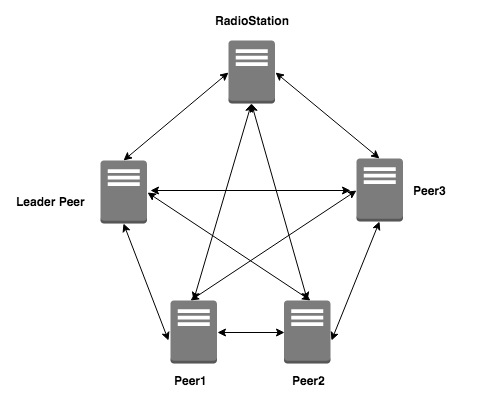

## loopchain의 기본 구조

### 기본 구조도

### RadioStation
* Peer들의 인증을 담당하고 Peer들의 목록을 관리합니다.

#### RadioStation과 Peer의 접속
* RadioStation과 Peer는 시작할 때에 자신의 인증서/개인키 경로를 입력합니다.
* Peer들의 인증서를 설치시 넣어주고 설정파일에서 이를 읽어서 처리하게 하고 있습니다. KMS(Key management system)지원하는 기능도 Enterprise용으로 지원합니다.

### Peer
* 블록 생성, 블록 관리, 트랜잭션 생성, 조회, 원장 조회 등의 기능을 처리합니다.
* Peer가 생성될 때에 RadioStation과 연결한다. 시작할 때에 RadioStation의 접속 정보(IP:Port)를 가지고 연결합니다.
* **가장 먼저 RadioStation에 연결되는 Peer가 Leader Peer가 됩니다.**
* 주의 : 최소 4개 이상의 Peer가 필요합니다.

#### Leader Peer
* 일정 시간마다 Transaction 들을 모아 Block을 만들고 보낸 다음 검증을 Peer 들에게 받아서 공표합니다.(검증 주기는 설정 가능합니다.)
* 다른 Peer를 Subscription(구독)한 다음에 Transaction / Block data를 동기화합니다.
* Leader Peer의 변경은 등록된 Peer의 순서대로 Leader 권한을 줍니다.(Round Robin). (주의: block 생성 개수 기준은 성능에 따라서 변경 가능합니다.)
